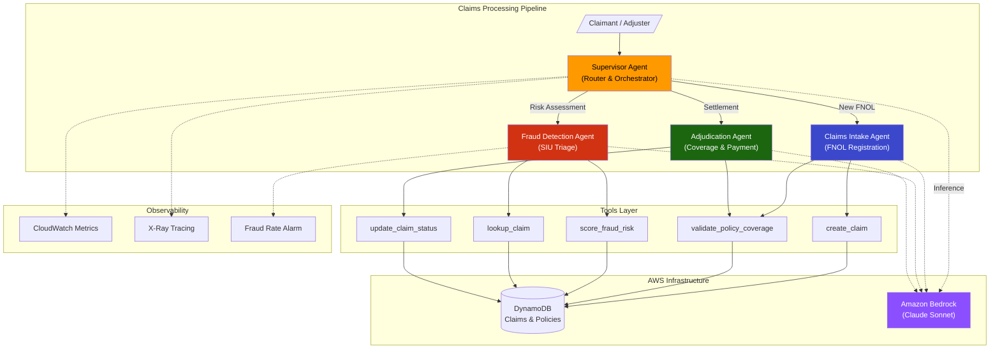

# Insurance Claims Multi-Agent Processing System

A production-grade multi-agent system for automated insurance claims processing, built with the [AWS Strands Agents SDK](https://github.com/strands-agents/sdk-python) and Amazon Bedrock. Demonstrates supervisor-delegate orchestration, domain-specific tooling, and enterprise patterns for the insurance industry.

## Architecture



## Features

- **Multi-Agent Orchestration** - Supervisor agent routes claims through specialist agents based on lifecycle stage
- **Insurance Domain Expertise** - Authentic FNOL processing, coverage verification, total loss determination, and subrogation identification
- **Fraud Detection** - Rule-based + pattern matching fraud scoring with configurable SIU referral thresholds
- **Production Patterns** - Guardrails (approval limits, max iterations), structured logging, distributed tracing, error handling
- **Tool Use** - Strands `@tool` decorator for DynamoDB operations, policy validation, and fraud scoring
- **Infrastructure as Code** - SAM/CloudFormation template with DynamoDB tables, IAM roles, and CloudWatch alarms
- **Configurable** - Environment variable overrides for all thresholds, model settings, and resource names

## Claims Lifecycle

```
FNOL Received → Under Review → Fraud Check → Coverage Verified → Adjudication → Approved/Denied → Closed
                                    ↓                                    ↓
                              SIU Referral                        Subrogation
```

| Stage | Agent | Decision |
|-------|-------|----------|
| Intake | Claims Intake | Register FNOL, validate policy, triage priority |
| Fraud Screening | Fraud Detection | Score risk, refer to SIU or clear for adjudication |
| Adjudication | Adjudication | Calculate settlement, approve/deny, identify subrogation |

## Quick Start

### Prerequisites

- Python 3.11+
- AWS account with Bedrock model access (Claude Sonnet)
- AWS credentials configured (`aws configure` or IAM role)

### Installation

```bash
# Clone the repository
git clone https://github.com/hasanmehdirizvi/insurance-claims-agent.git
cd insurance-claims-agent

# Create virtual environment
python -m venv .venv
source .venv/bin/activate

# Install dependencies
pip install -e ".[dev]"
```

### Deploy Infrastructure

```bash
cd infrastructure
sam build
sam deploy --guided --parameter-overrides Environment=dev
```

### Run the System

```bash
# List available demo scenarios
python -m src.main --list

# Run a specific scenario
python -m src.main standard_auto_collision
python -m src.main suspicious_total_loss
python -m src.main complex_property_damage

# Interactive mode
python -m src.main --interactive
```

### Run Tests

```bash
pytest tests/ -v --cov=src
```

## Project Structure

```
insurance-claims-agent/
├── src/
│   ├── agents/
│   │   ├── supervisor.py        # Router/orchestrator agent
│   │   ├── claims_intake.py     # FNOL intake specialist
│   │   ├── fraud_detection.py   # Fraud scoring specialist
│   │   └── adjudication.py      # Settlement determination
│   ├── tools/
│   │   ├── claims_db.py         # DynamoDB CRUD operations
│   │   ├── policy_validator.py  # Coverage verification
│   │   └── fraud_scorer.py      # Rule-based fraud scoring
│   ├── config.py                # Centralized configuration
│   └── main.py                  # Entry point with demo scenarios
├── infrastructure/
│   └── template.yaml            # SAM/CloudFormation (DynamoDB, IAM, CloudWatch)
├── tests/
│   └── test_claims_intake.py    # Unit tests with moto mocks
├── pyproject.toml
├── requirements.txt
└── README.md
```

## Tech Stack

| Component | Technology |
|-----------|-----------|
| Agent Framework | [Strands Agents SDK](https://github.com/strands-agents/sdk-python) |
| LLM | Amazon Bedrock (Claude Sonnet 4) |
| Database | Amazon DynamoDB |
| Infrastructure | AWS SAM / CloudFormation |
| Observability | CloudWatch Metrics + X-Ray Tracing |
| Configuration | Pydantic Settings |
| Logging | structlog |
| Testing | pytest + moto |

## Configuration

All settings can be overridden via environment variables:

| Variable | Default | Description |
|----------|---------|-------------|
| `CLAIMS_MODEL_MODEL_ID` | `us.anthropic.claude-sonnet-4-20250514` | Bedrock model ID |
| `CLAIMS_MODEL_REGION` | `us-west-2` | Bedrock API region |
| `CLAIMS_DYNAMO_CLAIMS_TABLE` | `insurance-claims` | Claims table name |
| `CLAIMS_GUARDRAILS_FRAUD_SCORE_THRESHOLD` | `0.7` | SIU referral threshold |
| `CLAIMS_GUARDRAILS_MAX_CLAIM_AMOUNT_AUTO_APPROVE` | `10000` | Auto-approve ceiling |
| `CLAIMS_GUARDRAILS_TOTAL_LOSS_THRESHOLD_PERCENT` | `75` | Total loss % of ACV |

## Security Considerations

- DynamoDB tables encrypted at rest with AWS KMS
- IAM roles follow least-privilege (scoped to specific tables and model ARNs)
- PII data tagged for compliance tracking
- Point-in-time recovery enabled for claims and policy tables
- No secrets in code - all configuration via environment variables or IAM roles

## Insurance Domain Glossary

| Term | Definition |
|------|-----------|
| **FNOL** | First Notice of Loss - initial claim report |
| **ACV** | Actual Cash Value - replacement cost minus depreciation |
| **SIU** | Special Investigations Unit - fraud investigation team |
| **Subrogation** | Recovery of claim costs from a responsible third party |
| **Total Loss** | When repair cost exceeds threshold % of vehicle/property value |
| **EUO** | Examination Under Oath - formal sworn testimony in fraud cases |
| **Adjuster** | Professional who evaluates and settles insurance claims |
| **Coverage Limit** | Maximum amount payable under a policy for a covered loss |
| **Deductible** | Amount the policyholder pays before insurance coverage applies |

## License

MIT
